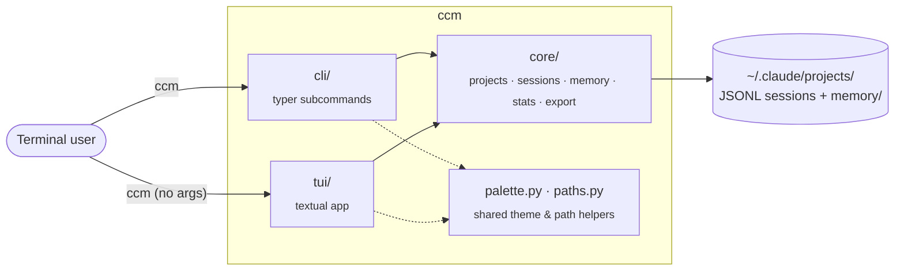

<div align="center">


**Claude Code Manager** — a CLI + TUI for everything Claude Code stores under `~/.claude/projects/`.

[](https://pypi.org/project/claudecm/)
[](https://pypi.org/project/claudecm/)
[](LICENSE)
[](https://www.python.org/downloads/)
[](https://docs.astral.sh/uv/)
[](https://github.com/QuocTang/ccm/stargazers)

List projects, browse sessions, view / delete / export them, inspect memory
files, see disk-usage stats — without `cd`-ing into a directory full of
URL-encoded path names.

</div>

---

## Quick start

```bash
uv tool install claudecm
ccm                  # launches the TUI
ccm ls               # subcommand mode
ccm stats            # disk-usage dashboard
```

> Requires Python 3.10+ and [uv](https://docs.astral.sh/uv/) (or `pipx`/`pip` if you prefer).
> The PyPI distribution is named **`claudecm`** (the unqualified `ccm` was
> already taken). The console command stays `ccm`.

## Why ccm

`~/.claude/projects/` accumulates fast: every Claude Code session writes a
JSONL file, every project keeps its own memory directory, and the folder names
are a one-way path encoding (`/home/q/my_projects/foo` →
`-home-q-my-projects-foo`). Going in with `ls` and `rm` is painful.

- **One pane to navigate them all** — projects on the left, sessions on the right, Claude-style spinner up top.
- **Subcommands for scripting** — `ccm ls --sort size -n 10`, `ccm export <project> -f md`, `ccm stats`.
- **Decodes folder names correctly** — by reading the real `cwd` from inside each session's JSONL, not by replacing `-` with `/` and hoping.
- **Knows about memory and PRs** — surfaces `memory/*.md`, counts messages by type, picks up custom session titles.
- **No daemon, no config** — operates directly on the on-disk layout Claude Code already uses.

## Installation

<details open>
<summary><b>From PyPI (recommended)</b></summary>

```bash
uv tool install claudecm     # global, exposes `ccm`
# alternatives:
pipx install claudecm
pip install --user claudecm
```

</details>

<details>
<summary><b>Run without installing (one-off)</b></summary>

```bash
uvx --from claudecm ccm ls
```

</details>

<details>
<summary><b>From source (latest <code>main</code>)</b></summary>

```bash
git clone https://github.com/QuocTang/ccm
cd ccm
uv tool install .            # global
# or for dev work:
uv sync --extra dev
uv run ccm --help
```

</details>

<details>
<summary><b>From a GitHub commit/branch</b></summary>

```bash
uv tool install git+https://github.com/QuocTang/ccm
```

</details>

## Usage

```bash
ccm                         # launch TUI (default when no args)
ccm ls                      # list projects (sorted by recent activity)
ccm ls -s size -n 10        # sort by size, top 10
ccm show <project>          # detail for one project
ccm sessions <project>      # list sessions of a project
ccm view <project> <sess>   # render messages of a session
ccm rm <project>            # delete a project directory (with confirm)
ccm rm-session <p> <s>      # delete one session
ccm export <p> [<s>] -f md  # export to markdown (or -f json | raw)
ccm memory <project>        # view memory files
ccm memory <p> --show NAME  # print one memory file
ccm memory <p> --rm NAME    # delete one memory file
ccm stats                   # disk usage dashboard
ccm tui                     # launch TUI explicitly
```

`<project>` accepts an encoded dir name, the real `cwd` path, the basename
(e.g. `my-project`), or any unique substring of either.

`<session>` accepts the full UUID or a unique prefix (the 8-char head shown
by `ccm sessions` is usually enough).

### TUI keys

| Key          | Action                               |
| ------------ | ------------------------------------ |
| `↑/↓` `j/k`  | Move cursor                          |
| `h/l` `←/→`  | Focus projects / sessions pane       |
| `Tab`        | Switch panes                         |
| `Enter`      | Drill in (project → sessions → view) |
| `m`          | Show memory for highlighted project  |
| `d`          | Delete focused project / session     |
| `r`          | Refresh                              |
| `q` `Ctrl+C` | Quit (or back inside a sub-screen)   |

Inside a delete-confirm modal: `y` / `Enter` to confirm, `n` / `Esc` to cancel.

## Architecture

Three layers, deliberately separated so domain code stays UI-agnostic.



The lossy folder-name encoding is the one bit that requires care: Claude Code
replaces both `/` and `_` with `-`, so `paths.real_cwd_from_sessions()` reads
the actual `cwd` field from the first session JSONL inside each directory.
The naive `-` → `/` replacement is only a fallback for empty projects.

## Development

```bash
uv sync --extra dev                                           # install + pytest
uv run pytest -q                                              # run all tests
uv run pytest tests/core/test_paths.py -k naive_decode        # one test
uv tool install . --force --reinstall                         # rebuild global `ccm`
```

See [`CLAUDE.md`](CLAUDE.md) for architecture notes and the textual / typer
gotchas we hit (lossy path encoding, `Widget._size` shadowing, markup escaping,
etc).

## Contributing

PRs welcome. Keep the three-layer split (`core` stays UI-agnostic), run
`uv run pytest -q` before pushing, and follow the gotchas in `CLAUDE.md` if you
touch `tui/`.

## Contributors

<a href="https://github.com/QuocTang/ccm/graphs/contributors">
  
</a>

## License

[MIT](LICENSE) © QuocTang

## Star history

[](https://star-history.com/#QuocTang/ccm&Date)
